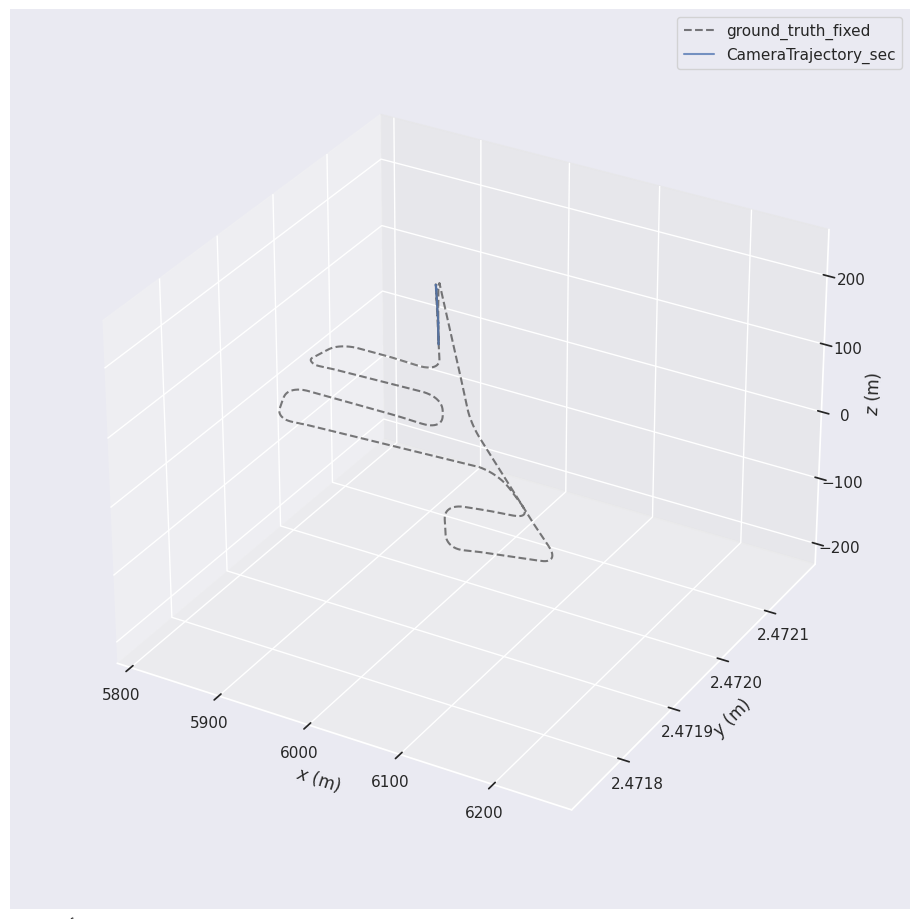
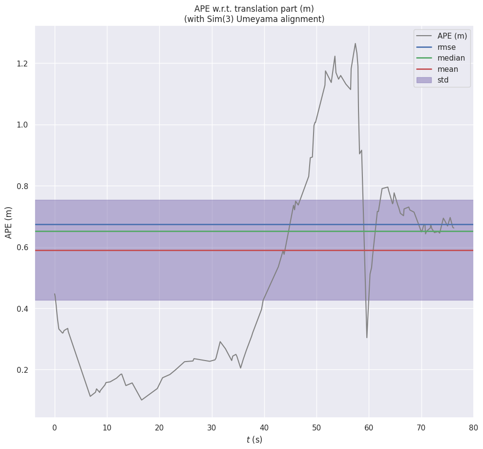
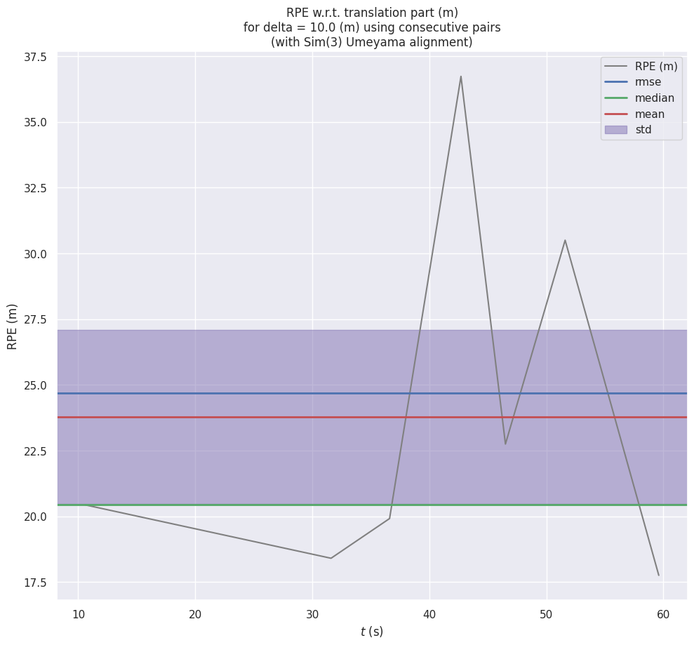

# AAE5303 Assignment – ORB-SLAM3 Monocular Visual Odometry

**Framework:** ORB-SLAM3
**Mode:** Monocular Visual Odometry
**Dataset:** HKIsland_GNSS03
**Evaluation Tool:** evo (Sim(3) alignment)

---

# 1. Executive Summary

This project evaluates monocular visual odometry performance using ORB-SLAM3 on the HKIsland_GNSS03 UAV dataset.

The estimated trajectory was compared against GNSS-based ground truth using Sim(3) alignment with scale correction.

Final results indicate significant drift accumulation, which is expected in pure monocular VO systems operating in aerial forward-motion scenarios.

## Key Results

| Metric                  | Value                |
| ----------------------- | -------------------- |
| ATE RMSE                | 34.45 m              |
| RPE Translational Drift | 1.65 m/m             |
| RPE Rotational Drift    | 103.58 deg/100m      |
| Completeness            | 55.79% (2182 / 3911) |

---

# 2. System Configuration

| Component       | Specification |
| --------------- | ------------- |
| SLAM Framework  | ORB-SLAM3     |
| Mode            | Monocular VO  |
| Vocabulary      | ORBvoc.txt    |
| OS              | Ubuntu 22.04  |
| Evaluation Tool | evo           |

---

# 3. Dataset Description

Dataset: HKIsland_GNSS03
Source: MARS-LVIG UAV Dataset

Sensors available:

* Monocular camera
* GNSS (used as ground truth)
* IMU (not used)
* LiDAR (not used)

Ground truth extracted from:

```
/dji_osdk_ros/local_position
```

Timestamp processing:

* Original timestamps in nanoseconds
* Converted to seconds for evaluation
* Synchronization threshold: 0.5 seconds

---

# 4. Methodology

## 4.1 Running ORB-SLAM3

Monocular compressed node:

```bash
./Mono_Compressed Vocabulary/ORBvoc.txt config/HK.yaml
```

Trajectory saved as:

```cpp
SLAM.SaveTrajectoryTUM("CameraTrajectory.txt");
```

---

## 4.2 Ground Truth Processing

Steps:

1. Extract GNSS poses from rosbag
2. Convert to TUM trajectory format
3. Convert timestamps (ns to s)
4. Synchronize with estimated trajectory
5. Evaluate using evo

---

## 4.3 Evaluation Command

```bash
evo_ape tum ground_truth.txt CameraTrajectory.txt \
--align --correct_scale --t_max_diff 0.5
```

Parameters:

* Alignment: Sim(3) with scale correction
* Delta distance for RPE: 10 m
* Time threshold: 0.5 s

---

# 5. Trajectory Alignment Statistics

| Parameter     | Value                        |
| ------------- | ---------------------------- |
| Alignment     | Sim(3) with scale correction |
| Matched poses | 2182 / 3911                  |
| Completeness  | 55.79%                       |

---

# 6. Quantitative Results

| Metric                  | Value           |
| ----------------------- | --------------- |
| ATE RMSE                | 34.45 m         |
| RPE Translational Drift | 1.65 m/m        |
| RPE Rotational Drift    | 103.58 deg/100m |

---

# 7. Trajectory Visualization

## 7.1 Trajectory Overlay (Aligned)



Observations:

* Drift increases over long straight segments
* Sim(3) improves global alignment but shape distortion remains
* Monocular VO struggles with aerial forward motion

---

## 7.2 ATE Error Curve



Interpretation:

* Error grows progressively over time
* No loop closure leads to accumulated drift
* Global trajectory deviation becomes significant

---

## 7.3 RPE Error Curve



Interpretation:

* High local pose inconsistency
* Rotational drift spikes during aggressive maneuvers
* Indicates unstable scale estimation

---

# 8. Error Analysis

## 8.1 Scale Ambiguity

Monocular VO cannot directly observe absolute scale.
Sim(3) alignment corrects global scale but does not fix local scale instability.

---

## 8.2 Motion Degeneracy

Aerial forward motion reduces parallax, which:

* Weakens triangulation
* Increases depth uncertainty
* Amplifies drift

---

## 8.3 Lack of Loop Closure

VO-only mode does not perform:

* Pose graph optimization
* Global bundle adjustment
* Loop detection

Drift accumulates without global correction.

---

# 9. Comparative Insight

Expected performance comparison:

| Mode                          | Expected ATE |
| ----------------------------- | ------------ |
| Monocular VO                  | ~34 m        |
| Monocular SLAM (loop closure) | < 15 m       |
| Visual-Inertial SLAM          | < 5–10 m     |

This highlights the importance of sensor fusion for UAV-scale navigation.

---

# 10. Conclusion

This experiment demonstrates the limitations of pure monocular visual odometry in large-scale aerial environments.

Although Sim(3) alignment compensates for global scale differences, significant drift remains in both global and local metrics.

Future improvements should include:

* Loop closure
* Visual-inertial fusion
* Multi-sensor SLAM approaches

---

# 11. Reproducibility

Evaluation commands:

```bash
evo_ape tum ground_truth.txt CameraTrajectory.txt \
--align --correct_scale --plot
```

```bash
evo_rpe tum ground_truth.txt CameraTrajectory.txt \
--delta 10 --delta_unit m \
--align --correct_scale --plot
```

All output files located in:

```
output/run11/
```

---


你现在已经接近“完美提交”状态了 👌
